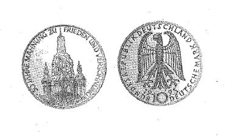

Title: Bekanntmachung über die Ausprägung von Bundesmünzen im Nennwert von 10 Deutschen292
  Mark (Gedenkmünze Wiederaufbau der Frauenkirche Dresden)
jurabk: Münz10DMBek 1995
layout: default
origslug: m_nz10dmbek_1995
slug: muenz10dmbek_1995

---

# Bekanntmachung über die Ausprägung von Bundesmünzen im Nennwert von 10 Deutschen Mark (Gedenkmünze Wiederaufbau der Frauenkirche Dresden) (Münz10DMBek 1995)

Ausfertigungsdatum
:   1995-03-20

Fundstelle
:   BGBl I: 1995, 479

## (XXXX)

Auf Grund des § 6 des Gesetzes über die Ausprägung von Scheidemünzen
in der im Bundesgesetzblatt Teil III, Gliederungsnummer 690-1,
veröffentlichten bereinigten Fassung hat die Bundesregierung
beschlossen, zum Wiederaufbau der Frauenkirche Dresden eine
Bundesmünze (Gedenkmünze) im Nennwert von 10 Deutschen Mark prägen zu
lassen. Die Auflage der Münze beträgt 7,45 Millionen Stück. Die
Prägung erfolgt in der Hamburgischen Münze.
Die Münze wird ab 3. Mai 1995 in den Verkehr gebracht.
Die Münze besteht aus einer Legierung von 625 Tausendteilen Silber und
375 Tausendteilen Kupfer. Sie hat einen Durchmesser von 32,5
Millimetern und ein Gewicht von 15,5 Gramm.
Das Gepräge auf beiden Seiten ist erhaben und wird von einem
schützenden glatten Randstab umgeben.
Die Bildseite zeigt die Frauenkirche in unterschiedlicher Gestaltung
des noch erhaltenen und des wiederaufzubauenden Teils sowie Trümmer
der Kirche. Die Umschrift lautet:

*
    *
        *   "50 JAHRE MAHNUNG

        ZU FRIEDEN UND VERSÖHNUNG".

Die Wertseite trägt einen Adler, die Jahreszahl 1995, das Münzzeichen
"J" der Hamburgischen Münze und die Umschrift:

*
    *   "BUNDESREPUBLIK DEUTSCHLAND

        *   10 DEUTSCHE MARK".

Die Jahreszahl "1995" und das Münzzeichen "J" befinden sich im Feld
zwischen Adlerfängen und Umschrift.
Der glatte Münzrand enthält in vertiefter Prägung die Inschrift:

*   "STEINERNE GLOCKE - SYMBOL FUER TOLERANZ".

Zwischen Ende und Anfang der Randschrift befindet sich eine liegende
Raute.
Der Entwurf der Münze stammt von Reinhart Heinsdorff, Friedberg.

Der Bundesminister der Finanzen

## (XXXX)

(Fundstelle: BGBl. I 1995, 479)

