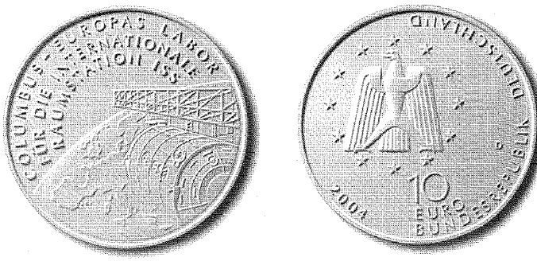

Title: Bekanntmachung über die Ausprägung von deutschen Euro-Gedenkmünzen im Nennwert388
  von 10 Euro (Gedenkmünze "Columbus - Europas Labor für die internationale Raumstation
  ISS")
jurabk: Münz10EuroBek 2004-08-27
layout: default
origslug: m_nz10eurobek_2004-08-27
slug: muenz10eurobek_2004-08-27

---

# Bekanntmachung über die Ausprägung von deutschen Euro-Gedenkmünzen im Nennwert von 10 Euro (Gedenkmünze "Columbus - Europas Labor für die internationale Raumstation ISS") (Münz10EuroBek 2004-08-27)

Ausfertigungsdatum
:   2004-08-27

Fundstelle
:   BGBl I: 2004, 2330

## (XXXX)

Gemäß den §§ 2, 4 und 5 des Münzgesetzes vom 16. Dezember 1999 (BGBl.
I S. 2402) hat die Bundesregierung beschlossen, zur Würdigung des
europäischen Columbus-Moduls für die internationale Raumstation ISS
eine deutsche Euro-Gedenkmünze im Nennwert von 10 Euro prägen zu
lassen.
Die Auflage der Münze beträgt 2.100.000 Stück, darunter 300.000 Stück
in Spiegelglanzausführung. Die Prägung erfolgt durch das Bayerische
Hauptmünzamt, München. Die Münze wird ab dem 4. November 2004 in den
Verkehr gebracht. Sie besteht aus einer Legierung von 925
Tausendteilen Silber und 75 Tausendteilen Kupfer, hat einen
Durchmesser von 32,5 Millimetern und eine Masse von 18 Gramm. Das
Gepräge auf beiden Seiten ist erhaben und wird von einem schützenden,
glatten Randstab umgeben.
Die Bildseite zeigt im Vordergrund das europäische Columbus-Modul,
sichtbar angekoppelt an die internationale Raumstation. Den
Hintergrund bildet die Weltkugel mit dem Kontinent Europa, den
europäischen Beitrag zur Raumstation unterstreichend. Beeindruckend
ist der Blick aus der Weltraumperspektive, der das Dramatische dieser
modernen Entdeckungsreise zum Ausdruck bringt. Reizvoll ist das
Wechselspiel von matten und polierten Flächen. Die Bildseite trägt den
Schriftzug "COLUMBUS - EUROPAS LABOR FÜR DIE INTERNATIONALE
RAUMSTATION ISS".
Die Wertseite korrespondiert in gelungener Weise mit der Bildseite.
Sie zeigt den Schriftzug "BUNDESREPUBLIK DEUTSCHLAND", die 12 Europa-
Sterne, Wertziffer und Wertbezeichnung, die Jahreszahl 2004 sowie das
Prägezeichen "D" des Bayerischen Hauptmünzamtes, München.
Der glatte Münzrand enthält in vertiefter Prägung die Inschrift:
"RAUMFAHRT VERBINDET DIE WELT".
Der Entwurf der Münze stammt von Herrn Frantisek Chochola, Hamburg.

## Schlussformel

Der Bundesminister der Finanzen

## (XXXX)

(Fundstelle: BGBl. I 2004, 2330)

