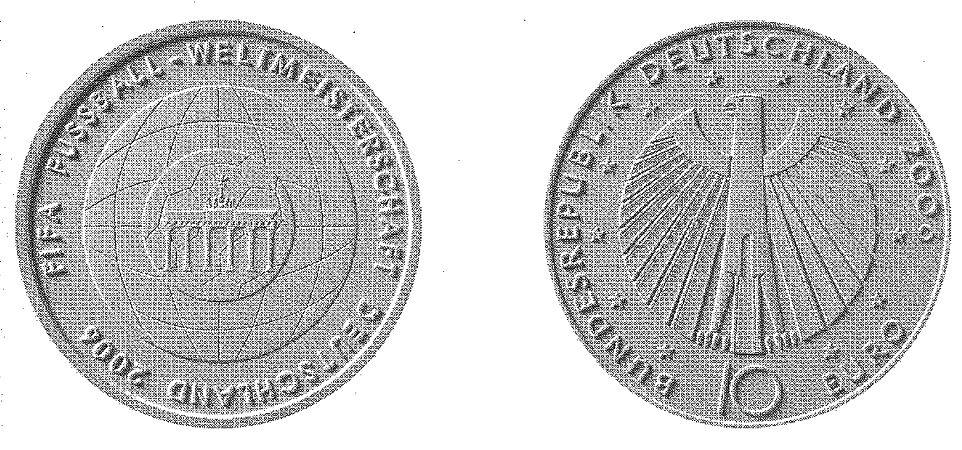

Title: Bekanntmachung über die Ausprägung von deutschen Euro-Gedenkmünzen im Nennwert393
  von 10 Euro (Gedenkmünze "FIFA Fußball-Weltmeisterschaft Deutschland 2006" - 4.
  Ausgabe 2006 -)
jurabk: Münz10EuroBek 2006-01-17
layout: default
origslug: m_nz10eurobek_2006-01-17
slug: muenz10eurobek_2006-01-17

---

# Bekanntmachung über die Ausprägung von deutschen Euro-Gedenkmünzen im Nennwert von 10 Euro (Gedenkmünze "FIFA Fußball-Weltmeisterschaft Deutschland 2006" - 4. Ausgabe 2006 -) (Münz10EuroBek 2006-01-17)

Ausfertigungsdatum
:   2006-01-17

Fundstelle
:   BGBl I: 2006, 161

## (XXXX)

Gemäß den §§ 2, 4 und 5 des Münzgesetzes vom 16. Dezember 1999 (BGBl.
I S. 2402) hat die Bundesregierung beschlossen, zum Thema "FIFA
Fußball-Weltmeisterschaft Deutschland 2006" eine Serie von vier
deutschen Euro-Gedenkmünzen im Nennwert von 10 Euro prägen zu lassen
und in den Jahren 2003 bis 2006 jährlich eine Münze auszugeben.
Die Auflage der Münze des Jahres 2006 (4. Ausgabe) beträgt max.
4\.400.000 Stück, darunter max. 400.000 Stück in
Spiegelglanzausführung. Die Prägung erfolgt durch die fünf staatlichen
deutschen Münzstätten in Berlin, München, Stuttgart, Karlsruhe und
Hamburg. Die Münze wird ab dem 9. Februar 2006 in den Verkehr
gebracht. Sie besteht aus einer Legierung von 925 Tausendteilen Silber
und 75 Tausendteilen Kupfer, hat einen Durchmesser von 32,5
Millimetern und eine Masse von 18 Gramm. Das Gepräge auf beiden Seiten
ist erhaben und wird von einem schützenden, glatten Randstab umgeben.
Die Bildseite zeigt den Fußball als verbindendes Element zwischen
Deutschland, symbolisiert durch das Brandenburger Tor, und der Welt,
symbolisiert durch das Gradnetz der Erde. Das Motiv wird durch die
Umschrift "FIFA FUSSBALL-WELTMEISTERSCHAFT DEUTSCHLAND 2006" umrahmt.
Die Wertseite trägt einen Adler, zwölf Sterne, den Nennwert "10 EURO",
die Umschrift "BUNDESREPUBLIK DEUTSCHLAND" und die Jahreszahl 2006.
Der glatte Münzrand enthält in vertiefter Prägung die Inschrift:

*
    *
        *   "DIE WELT ZU GAST BEI FREUNDEN"

und die Münzzeichen "A . D . F . G . J" der fünf deutschen
Prägestätten.
Der Entwurf der Münze stammt von Lucia Maria Hardegen, Bonn
(Bildseite) und Erich Ott, München (Wertseite).

## Schlussformel

Der Bundesminister der Finanzen

## (XXXX)

(Fundstelle: BGBl. I 2006, 161)

