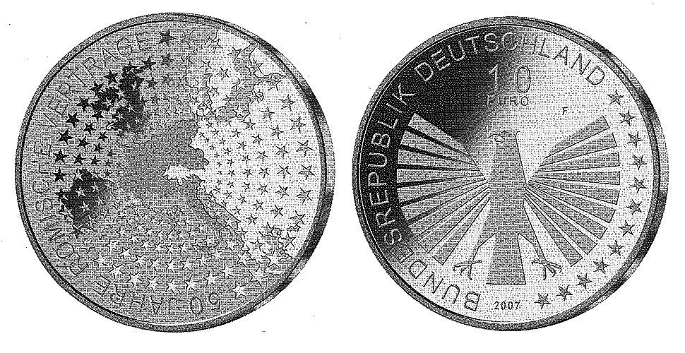

Title: Bekanntmachung über die Ausprägung von deutschen Euro-Gedenkmünzen im Nennwert363
  von 10 Euro (Gedenkmünze "50 Jahre Römische Verträge")
jurabk: Münz10EuroBek 2007-01-24
layout: default
origslug: m_nz10eurobek_2007-01-24
slug: muenz10eurobek_2007-01-24

---

# Bekanntmachung über die Ausprägung von deutschen Euro-Gedenkmünzen im Nennwert von 10 Euro (Gedenkmünze "50 Jahre Römische Verträge") (Münz10EuroBek 2007-01-24)

Ausfertigungsdatum
:   2007-01-24

Fundstelle
:   BGBl I: 2007, 65

## (XXXX)

Gemäß den §§ 2, 4 und 5 des Münzgesetzes vom 16. Dezember 1999 (BGBl.
I S. 2402) hat die Bundesregierung beschlossen, zur Würdigung des 50.
Jahrestages der Unterzeichnung der Römischen Verträge eine deutsche
Euro-Gedenkmünze im Nennwert von 10 Euro prägen zu lassen.
Die Auflage der Münze beträgt 1.900.000 Stück, darunter 300.000 Stück
in Spiegelglanzausführung. Die Prägung erfolgt durch die Staatlichen
Münzen Baden-Württemberg, Prägestätte Stuttgart.
Die Münze wird ab dem 1. März 2007 in den Verkehr gebracht. Sie
besteht aus einer Legierung von 925 Tausendteilen Silber und 75
Tausendteilen Kupfer, hat einen Durchmesser von 32,5 Millimetern und
eine Masse von 18 Gramm. Das Gepräge auf beiden Seiten ist erhaben und
wird von einem schützenden, glatten Randstab umgeben.
Die Bildseite zeigt in ihrem Zentrum die Umrisse der sechs
Gründerstaaten der Europäischen Gemeinschaften. Dieser Kern des
europäischen Einigungswerkes strahlt auf das übrige - stilisiert
dargestellte - Europa aus und symbolisiert damit die Offenheit des
Integrationsprozesses sowie die Bedeutung des geeinten Europas in der
Welt.
Die Wertseite harmoniert in künstlerisch überzeugender Weise mit der
Bildseite. Sie zeigt den Bundesadler, den Schriftzug "BUNDESREPUBLIK
DEUTSCHLAND", die Wertziffer und Wertbezeichnung, die Jahreszahl 2007
sowie das Prägezeichen "F" der Staatlichen Münzen Baden-Württemberg,
Prägestätte Stuttgart.
Der glatte Münzrand enthält in vertiefter Prägung die Inschrift:
"EUROPÄISCHE UNION . IN VIELFALT GEEINT .".
Der Entwurf der Münze stammt von Herrn Carsten Mahn, Berlin.

## Schlussformel

Der Bundesminister der Finanzen

## (XXXX)

(Fundstelle: BGBl. I 2007, 65)

