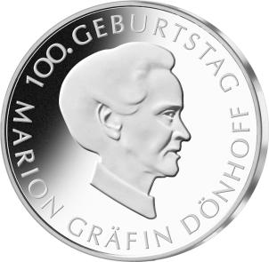
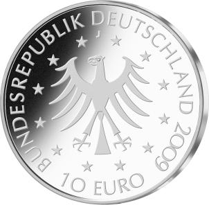

Title: Bekanntmachung über die Ausprägung von deutschen Euro-Gedenkmünzen im Nennwert416
  von 10 Euro (Gedenkmünze „100. Geburtstag Marion Gräfin Dönhoff“)
jurabk: Münz10EuroBek 2009-09-04
layout: default
origslug: m_nz10eurobek_2009-09-04
slug: muenz10eurobek_2009-09-04

---

# Bekanntmachung über die Ausprägung von deutschen Euro-Gedenkmünzen im Nennwert von 10 Euro (Gedenkmünze „100. Geburtstag Marion Gräfin Dönhoff“) (Münz10EuroBek 2009-09-04)

Ausfertigungsdatum
:   2009-09-04

Fundstelle
:   BGBl I: 2009, 3015

## (XXXX)

Gemäß den §§ 2, 4 und 5 des Münzgesetzes vom 16. Dezember 1999 (BGBl.
I S. 2402) hat die Bundesregierung beschlossen, eine 10-Euro-
Gedenkmünze „100. Geburtstag Marion Gräfin Dönhoff“ prägen zu lassen.

Die Auflage der Münze beträgt maximal 1,8 Millionen Stück, darunter
maximal 200 000 Stück in Spiegelglanzausführung. Die Prägung erfolgt
durch die Hamburgische Münze.

Die Münze wird ab dem 30. November 2009 in den Verkehr gebracht. Sie
besteht aus einer Legierung von 925 Tausendteilen Silber und 75
Tausendteilen Kupfer, hat einen Durchmesser von 32,5 Millimetern und
eine Masse von 18 Gramm. Das Gepräge auf beiden Seiten ist erhaben und
wird von einem schützenden, glatten Randstab umgeben.

Auf der Bildseite wird Marion Gräfin Dönhoff im Profil gezeigt. Die
scharf geschnittene Silhouette erinnert sowohl an die alte als auch an
die junge Gräfin. Das Profil spiegelt die Strenge und Konsequenz, aber
auch die fast durchsichtige Zartheit ihrer Person wider. Ein für
Marion Gräfin Dönhoff typischer Moment ist erfasst, in dem
konzentriertes Zuhören und der Wille, etwas zu sagen und einzugreifen,
in der Balance sind.

Die Wertseite zeigt einen Adler, den Schriftzug „BUNDESREPUBLIK
DEUTSCHLAND“, die zwölf Europa-Sterne, die Wertziffer mit der Euro-
Bezeichnung sowie die Jahreszahl 2009 und das Münzzeichen J der
Hamburgischen Münze.

Der glatte Münzrand enthält in vertiefter Prägung die Inschrift:

„ \* LIEBEN OHNE ZU BESITZEN \* “.

Der Entwurf der Münze stammt von Herrn Prof. Höpfner, Berlin.

## Schlussformel

Der Bundesminister der Finanzen

## (XXXX)

(Fundstelle: BGBl. 2009, 3015)

*    *        
    *        

