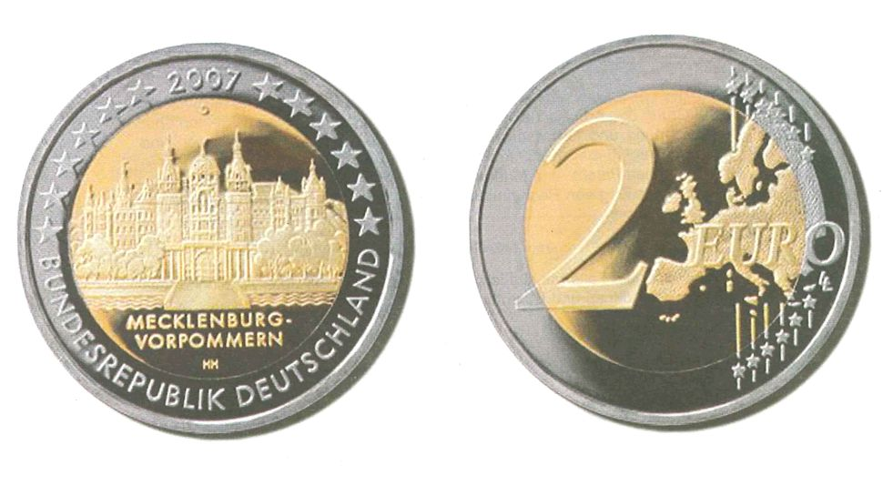

Title: Bekanntmachung über die Ausprägung von deutschen Euro-Gedenkmünzen im Nennwert379
  von 2 Euro (Gedenkmünze "Mecklenburg-Vorpommern")
jurabk: Münz2EuroBek 2006-11
layout: default
origslug: m_nz2eurobek_2006-11
slug: muenz2eurobek_2006-11

---

# Bekanntmachung über die Ausprägung von deutschen Euro-Gedenkmünzen im Nennwert von 2 Euro (Gedenkmünze "Mecklenburg-Vorpommern") (Münz2EuroBek 2006-11)

Ausfertigungsdatum
:   2006-11-22

Fundstelle
:   BGBl I: 2006, 2667

## (XXXX)

Gemäß den §§ 2, 4 und 5 des Münzgesetzes vom 16. Dezember 1999 (BGBl.
I S. 2402) hat die Bundesregierung beschlossen, eine 2-Euro-
Gedenkmünze "Mecklenburg-Vorpommern" im Rahmen einer Serie
"Bundesländer" prägen zu lassen.
Die Auflage der Münze beträgt 30 Millionen Stück. Daneben werden für
das Sammlerprodukt deutsche Euro-Kursmünzensätze 375.000 Stück in
Spiegelglanzausführung geprägt.
Die Münze wird ab dem 2. Februar 2007 in den Verkehr gebracht.
Materialeinsatz und technische Parameter der 2-Euro-Gedenkmünze
entsprechen der 2-Euro-Umlaufmünze. Der Münzrand enthält in vertiefter
Prägung unverändert die Inschrift:

*
    *
        *   "EINIGKEIT UND RECHT UND FREIHEIT".

Die nationale Seite der Gedenkmünze zeigt das Schloss Schwerin in
seiner architektonischen Vielfalt, von der Stadtseite betrachtet.
Durch die bildliche Darstellung des Wassers und den Anschnitt der
Brücke wird die Insellage des Schlosses betont. Die von der Stadtseite
aus sichtbaren typischen Kaimauern und Balustraden sind
wirklichkeitsnah dargestellt. Durch die beidseitig angeordneten Bäume
ist die das Schloss umgebende Parkanlage, der Burggarten, angedeutet.
Der Gebäudekomplex ist in seiner interessanten Dach- und
Turmlandschaft prägnant getroffen. Die Länderbezeichnung "MECKLENBURG-
VORPOMMERN" verknüpft das abgebildete Bauwerk, Schloss Schwerin, mit
dem Bundesland. Das Münzzeichen der jeweiligen Prägestätte ("A", "D",
"F", "G" oder "J") befindet sich im oberen Kernbereich.
Auf dem Außenring sind die europäischen Sterne, das Ausgabejahr 2007
und das Ausgabeland "BUNDESREPUBLIK DEUTSCHLAND" abgebildet.
Der Entwurf der nationalen Seite der Gedenkmünze stammt von Herrn
Heinz Hoyer aus Berlin.

## Schlussformel

Der Bundesminister der Finanzen

## (XXXX)

(Fundstelle: BGBl. I 2006, 2667)

